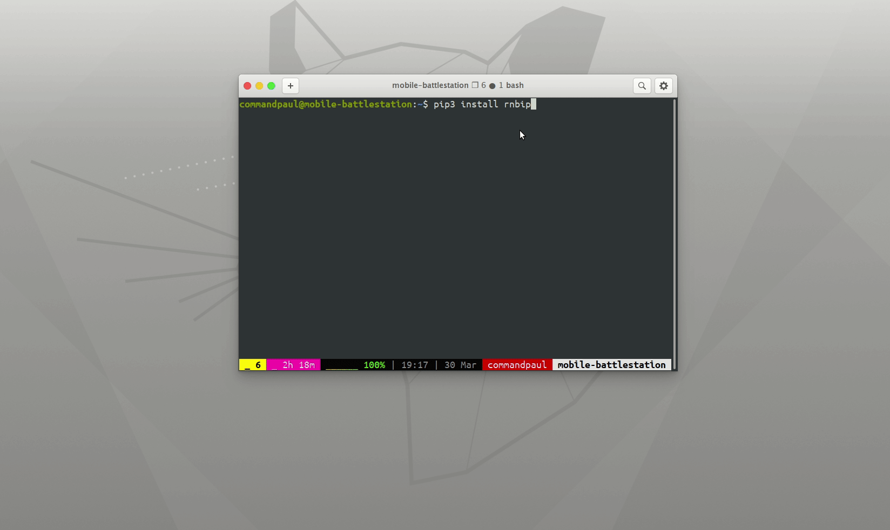

# RNBIP Emulator
#### A Visal Exploration of the RNBIP ISA as interpreted as a single bus micro architecture

The RNBIP Emulator is distributed as a python package and the latest release should always be available on Pypi.     

### System Requirements
 - Microsoft Windows 7/8/10 , Linux Distribution (kernel 4+)
 - Python3.6+ installed and available on path
 - python-pip installed and available on path

### Setup Instructions Windows
  - Download and Install [Python3](https://www.python.org/downloads/)
  - Open CommandPrompt or Windows Powershell

You can Install the rnbip with the following command.
```bash
pip3 install rnbip
```


### Launch RNBIP
```bash
python3 -m rnbip_emulator
```

### Setup Instructions Linux
Use your favourite package manager to install python3 and python-pip.   
Install the rnbip with the following command.
```bash
pip3 install rnbip
```
### Launch RNBIP
```bash
python3 -m rnbip_emulator
```
Alternatively, if installed scripts are added to path by default
```bash
rnbip
```

## Found a Bug / Feature Request ?
**FILE AN ISSUE :)**

## Enjoyed Learning Digital Electronics with the RNBIP Emulator ? Here are some of our Ideas for ways you could contribute.
 -[] COCO-TB Verilator Co Simulation Setup
 -[] Emulator to Xilinx Nexys 4 Fpga Project One Click Build instrumentation
 -[] Web Based emulator
 -[] Create an LLVM Backend for RNBIP 8/16
Please Contact: Prof. R.N.Biswas or Paul George (command.paul@gmail.com) , Vedant Chakravarty and Prasanna Natarajan for more information / Assistance.

